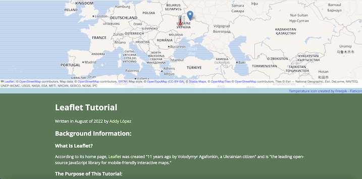
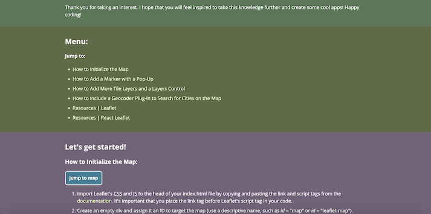

# Leaflet Tutorial

**_View this project:_** [https://gilded-gelato-34cd40.netlify.app/](https://gilded-gelato-34cd40.netlify.app/)

## Description

A self-directed, independently motivated experiment in exploring Leaflet using vanilla JS.

The web page provides a short step-by-step tutorial for developers to get started with Leaflet in order to build interactive map features that can be integrated with other data. Learn how to initialize a map, create a marker with a pop-up, add a layers control, and include a geocoder to search for different cities.

Tutorial includes from top to bottom:

1. a map to facillitate instruction and learning,
2. background information to clarify the project's raison d'être,
3. a site menu to navigate the tutorial and for learners to jump between the map and each section,
4. clear, step-by-step instructions in each section with code examples and supplementary details,
5. and finally, resources for learning Leaflet and React Leaflet.

**_Learning objective:_** To teach myself and other developers how to get started with Leaflet JS to create interactive maps. In addition to HTML, CSS, and JavaScript, _this project showcases skill both in reading unfamiliar documentation and in communicating technical knowledge through clear writing supported by a well-designed pedagogical interface_.

## Features

- HTML, CSS, and Javascript files are all annotated to benefit learners of any level who wish to consult my code as a practical, instructional example of the concepts and skills taught in the tutorial

- Semantic HTML (conscientiously coded with accessibility concerns, SEO, legibility, and maintainability in mind)

- Responsive CSS, with testing for devices of all sizes using the toggle device toolbar in Google Chrome's DevTools

- Interactive, pedagogical map coded with JavaScript. It includes and illustrates every feature that is taught in the tutorial: the initialization of the map, a default marker with a pop-up, a customized marker with a pop-up, a layers control that can toggle between five different tile layers and affect the visibility of both markers, a geocoder to search for different locations on the map, proper attributions, and display of the latitude and longitude of the cursor as it moves across the map.

- Step-by-step instructions (assuming no prior knowledge of Leaflet) that transmit technical knowledge based on a thorough understanding of the techniques and features outlined in the Leaflet documentation and alluded to in scattered sources across the web. I created this tutorial to offer to my development community a dependable, high-quality reference that consolidates information that to my knowledge can be found nowhere else on the Web all on a single page.

- Site menu and handy "jump to" buttons for learners to toggle back and forth between the map and each section while learning

- A polished README using Markdown

## Accessibility & Design Considerations:

- Informed typography: In line with the standard Web Content Accessibility Guidelines, the minimum font-size is sixteen pixels, and the line-height is set to 1.5. The chosen font (imported from Google Fonts), with its clean sans-serif characters and pleasing balance of round and straight edges, was selected for its legibility and poise. Some extra white space between list items makes the numbered and bullet-pointed instructions easier to follow without getting lost. Additionally, presenting code snippets in a monospaced typeface visually differentiates their function from the rest of the text and makes them easy to identify. Together, these typographical decisions should make this page more aesthetically appealing to my target audience of developers and entice them to actually use the resource I created.

- Experimentation with Adobe Color's color wheel to generate a "double split complementary" color scheme, which I then further refined. The earthy tones complement the dominant terrestrial green (punning on the "Leaf" in "Leaflet") yet also cut beneficially against the visual monotony of the text. The sectional background colors serve a pedagogical purpose and improve the UI for learners because they each group content based on a discrete skill that is being taught; further, they make it more likely that, in associating the technical information with a different color, the learner will better remember what is read. The warmly dull, clay-like undertones are easy on the eye when reading slowly, while the high contrast of the dark blue code examples make it easy to skim the page and locate that information without the cumbersome process of having to comb through every line.

- Further use of Adobe Color's color wheel and accessibility tools, along with Google Chrome's DevTools, to ensure sufficient contrast ratios between links, text, and background colors, on par with the standard Web Content Accessibility Guidelines.

- CSS transform is applied to the buttons to make them more interactive. At the same time, when the button is clicked, its background color changes to look darker. These details lend a skeuomorphic effect to an otherwise flat design.

- All abbreviations are assigned the abbr tag in the HTML with title attributes, which is an accessibility concern, as it improves the experience of those who are browsing with screen readers.

- Links are also assigned title attributes for accessibility and SEO concerns, along with hover, active, and visited effects to heighten their interactivity.

- Accessibility rating by Lighthouse audit: 96/100 for desktops and 96/100 for mobile devices

## Preview

---

